# MARS-NET — Mars Habitat Communication Network

> Enterprise-style computer network simulation for a hypothetical Mars colony, implemented and validated in Cisco Packet Tracer.

[](https://www.netacad.com/cisco-packet-tracer)
[](#routing-and-connectivity)
[](#security-and-segmentation)
[](#network-services)

## What this repository demonstrates

MARS-NET is a multi-zone enterprise network designed around Research, Medical, Habitat, Security, and Earth-facing connectivity. The network combines segmentation, dynamic routing, address translation, access control, and centralized application-layer services in one Packet Tracer environment.

The submitted report states that Cisco Packet Tracer was used to design, configure, test, and troubleshoot the network, including VLANs, Router-on-a-Stick, EIGRP, OSPF, DHCP, DNS, SMTP, NAT, ACLs, Ping/ICMP, traceroute, and Simulation Mode.

## Reviewer fast path

| Need | Go to |
|---|---|
| See the whole network | `docs/evidence/topology.png` |
| Inspect the actual simulator artifact | `network/MARS-NET.pkt` |
| Review design and addressing | `docs/architecture.md` |
| Review routing / VLAN / NAT / ACL configuration | `configs/` |
| Reproduce validation | `docs/testing.md` and `DEMO-RUNBOOK.md` |
| Review academic report | `academic/MARS-NET_Lab_Report.docx` |
| Review presentation | `academic/MARS-NET_Presentation.pdf` |
| See who did what | `CONTRIBUTIONS.md` |

## Architecture at a glance

```mermaid
flowchart LR
    E[Earth Network
20.0.0.0/24] --> EG[Earth Gateway
200.0.10.2/30]
    EG <-- OSPF --> MG[Mars Gateway
200.0.10.1/30]
    MG <-- EIGRP/Redistribution --> R[Research
10.0.10.0/24]
    R --> M[Medical
10.0.20.0/24]
    M --> H[Habitat Inter-VLAN Router]
    H --> S[Security
10.0.200.0/24]
    H --> V10[VLAN 10
Residential]
    H --> V20[VLAN 20
Greenhouse]
    H --> V30[VLAN 30
Robot Maintenance]
    H --> V40[VLAN 40
Tourist]
    S --> SV[Server Network
10.0.100.0/24
DHCP | DNS | SMTP]
```

The report defines the Habitat VLANs as Residential (10), Greenhouse (20), Robot Maintenance (30), and Tourist (40), with centralized DHCP, DNS, and SMTP services on the server network.

### Topology

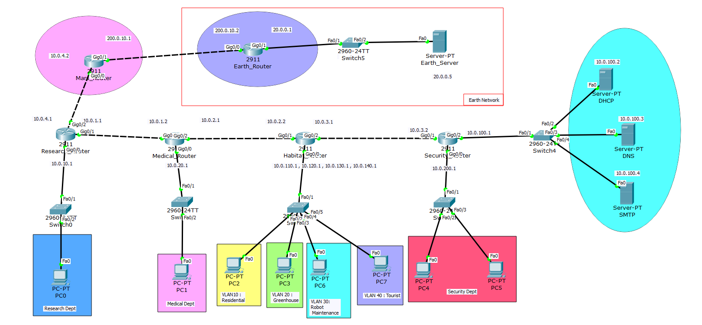

## Technology stack

| Area | Technologies implemented |
|---|---|
| Simulation | Cisco Packet Tracer |
| Segmentation | VLAN 10/20/30/40, 802.1Q trunking |
| Inter-VLAN routing | Router-on-a-Stick |
| Internal routing | EIGRP |
| Mars ↔ Earth routing | OSPF |
| Protocol integration | EIGRP ↔ OSPF route redistribution |
| Address translation | NAT/PAT |
| Security | Extended ACLs |
| IP management | DHCP + `ip helper-address` |
| Name resolution | DNS |
| Messaging | SMTP |
| Validation | Ping, traceroute, routing tables, Packet Tracer Simulation Mode |

The submitted IP plan uses 10.0.x.x private networks for Mars segments, a 200.0.10.0/30 Mars–Earth transit link, and 20.0.0.0/24 for the Earth LAN.

## Routing and connectivity

MARS-NET uses EIGRP inside the Mars network and OSPF across the Mars–Earth gateway connection. The Mars gateway performs route redistribution between the two routing domains. The report documents EIGRP autonomous system 10 and OSPF process 1.

## Security and segmentation

The Habitat department is segmented into four VLANs. The documented ACL policy limits cross-department traffic according to operational requirements; a dedicated ACL on the Security router protects the server/critical network from unauthorized internal access.

### Documented access policy

| Source | Allowed destinations |
|---|---|
| Security | All departments |
| Tourist | Medical, Residential |
| Robot Maintenance | Research, Residential |
| Greenhouse | Residential, Medical |
| Residential | Medical |
| Medical | Research, Residential, Greenhouse, Robot Maintenance, Tourist |
| Research | Medical, Robot Maintenance |

This matrix is reproduced from the submitted project report.

## Network services

The server network (`10.0.100.0/24`) contains:

- DHCP Server — `10.0.100.2`
- DNS Server — `10.0.100.3`
- SMTP Server — `10.0.100.4`

The report documents DHCP relay using `ip helper-address`, DNS record configuration, and SMTP user/mailbox setup.

## Verification evidence

The submitted report records successful validation of VLANs, routing, DHCP, DNS, SMTP, NAT, and ACL behavior, including authorized communication and blocked traffic.

### Routing
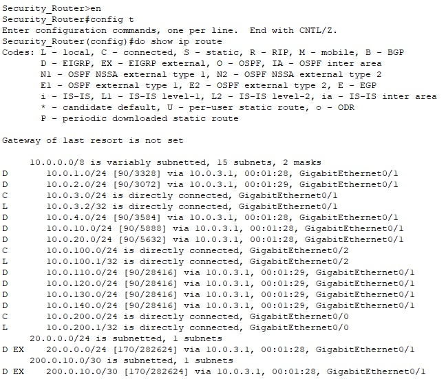

### VLANs and trunking
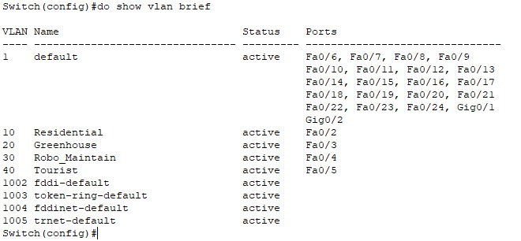
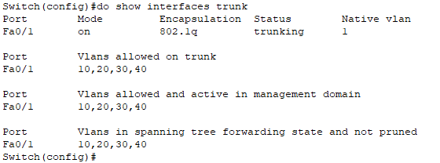

### NAT
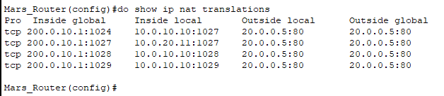

### ACLs
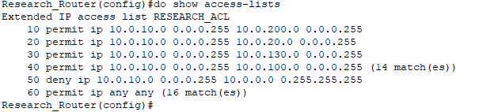
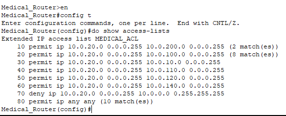
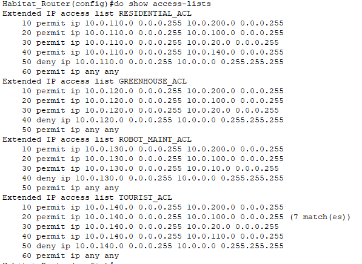
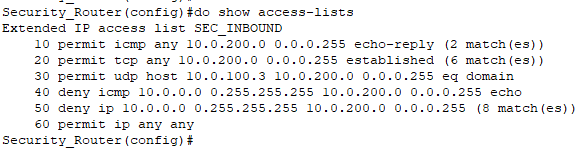

### DHCP / DNS / SMTP
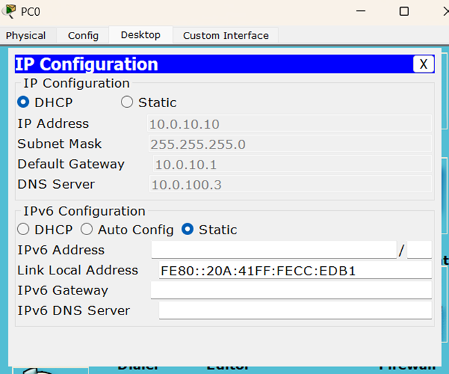
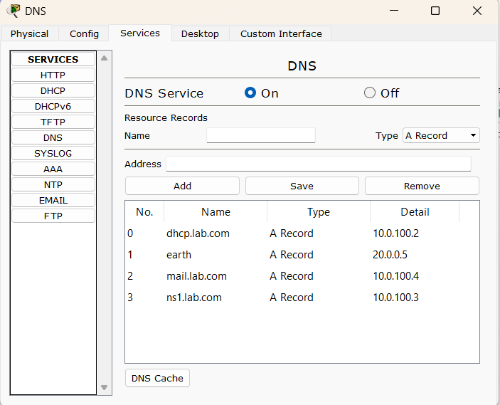
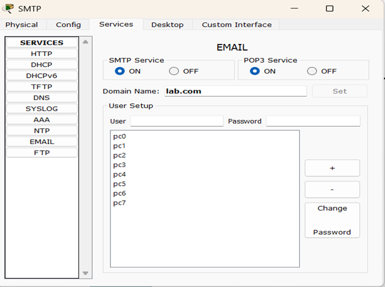
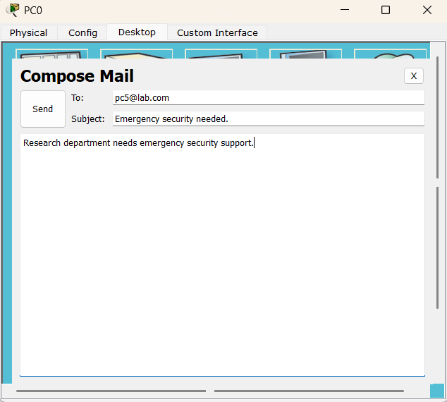
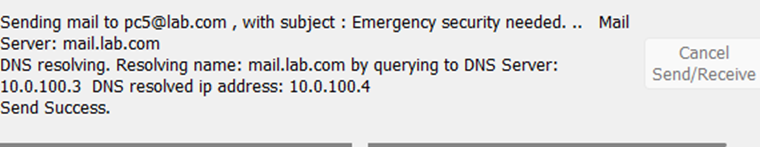
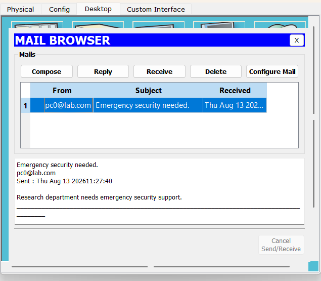

## Quick start

1. Install a Cisco Packet Tracer version that can open the supplied `.pkt` file.
2. Open `network/MARS-NET.pkt`.
3. Inspect the topology first; then move through the feature groups in `/configs`.
4. Use Packet Tracer Simulation Mode plus Ping/traceroute to reproduce the validation flow described in the report.
5. Compare device state with the evidence screenshots in `docs/evidence/`.

## Repository map

```text
MARS-NET-github/
├── README.md
├── .gitignore
├── .gitattributes
├── CONTRIBUTIONS.md
├── PUBLIC-REPO-CHECKLIST.md
├── GITHUB-UPLOAD-GUIDE.md
├── academic/
│   ├── MARS-NET_Lab_Report.docx
│   ├── MARS-NET_Presentation.pptx
│   └── MARS-NET_Presentation.pdf
├── network/
│   ├── MARS-NET.pkt              # add your final Packet Tracer file
│   └── README.md
├── configs/
│   ├── routing.md
│   ├── vlan.md
│   ├── nat.md
│   ├── acl.md
│   └── services.md
└── docs/
    ├── architecture.md
    ├── testing.md
    ├── evidence/
    └── presentation-slides/
```

## Academic materials

The complete original report and presentation are preserved under `academic/`. The report identifies the project as a CSE322 Computer Networks Lab submission supervised by Rowzatul Zannat at Daffodil International University.

## Engineering relevance

For a network/cloud reviewer, the project demonstrates a useful set of foundational infrastructure skills: logical segmentation, router-based interconnects, dynamic routing, route-domain integration, NAT/PAT, policy-based traffic filtering, centralized network services, and troubleshooting/validation. It is a **simulation project**, not a production cloud deployment; the repository keeps that distinction explicit.

## Transferable infrastructure concepts

Although this is a Packet Tracer simulation rather than a cloud deployment, the design maps cleanly to infrastructure concepts a cloud/network engineer would recognize:

| MARS-NET concept | Transferable infrastructure concept |
|---|---|
| VLAN segmentation | Logical isolation / separate network domains |
| Router-on-a-Stick | Layer-3 gatewaying between isolated segments |
| EIGRP / OSPF | Dynamic control-plane routing |
| NAT/PAT | Address translation and controlled egress |
| Extended ACLs | Explicit traffic policy / filtering |
| DHCP + DNS | Core network services and service discovery |
| Packet Tracer Simulation Mode | Traffic-path validation and troubleshooting |

These are conceptual parallels only; the repository does not claim that a cloud platform was used.

## Known limitations

The submitted report notes that the network is simulated in Packet Tracer rather than on physical infrastructure and that the Mars–Earth connection is simplified. It identifies future directions including firewalls, VPNs, IDS, redundant links, monitoring, IPv6, and more realistic interplanetary communication modeling.

## Team

- **Shanita Shafi Mugdha** — Student ID 241-15-511
- **Shafayat Yeamin Jian** — Student ID 241-15-679

The submitted report identifies both students as project authors.

## License / academic use

No software license was specified in the submitted academic materials. Treat this repository as an academic portfolio project unless the authors add an explicit license.
